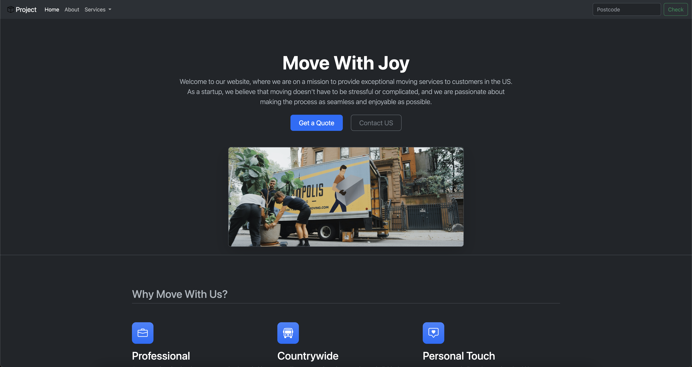

# Move With Joy

[](#)
> A professional one-page website designed for a moving services startup, featuring a sleek, modern design with engaging elements to enhance user experience.

## Overview

**Move With Joy**  is a clean and minimalistic website tailored for moving service startups. It includes an interactive carousel for showcasing images, a call-to-action section for customer engagement, and a responsive layout for optimal viewing across all devices.


## Preview

<p align="center">
  
</p>

## Features

- **Image Carousel:** Dynamic image slider to highlight services visually.
- **Responsive Design:** Fully optimized for desktop and mobile devices.
- **Call-to-Action:** Includes buttons for users to get a quote or contact the company.

## Live Demo

**Explore the live version here:** [View Live Demo](https://marius-bogdan.com/projects/moving-company-startup-app/)

## Local Setup

1. **Clone** the repository:
   ```bash
   git clone https://github.com/MIBogdan/moving-company-startup-app.git
   ```
2. **Open** the `index.html` file in your browser
   *- or use a local development server (like VS Code Live Server) for a smoother development experience.*

---

## Author

**Marius Bogdan**  
[Personal portfolio](https://marius-bogdan.com/)

Feel free to reach out for any questions or collaborations!

## License

This project is provided for testing and demonstration purposes only. All rights are reserved. No part of this project may be redistributed, reuploaded, or used in any manner (commercially or otherwise) without explicit written permission from the author.
